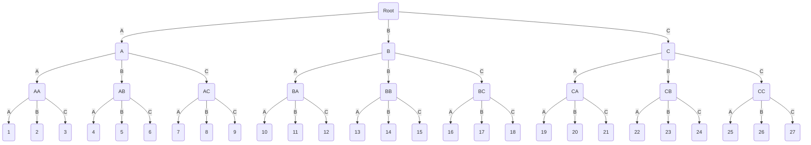

# DummyGame

This is the DummyGame tree structure used for testing the Searcher.

```mermaid
graph TD;
    R("Root")
    R -->|A| A1("A")
    R -->|B| B1("B")
    R -->|C| C1("C")
    
    A1 -->|A| AA("AA")
    A1 -->|B| AB("AB")
    A1 -->|C| AC("AC")
    
    B1 -->|A| BA("BA")
    B1 -->|B| BB("BB")
    B1 -->|C| BC("BC")
    
    C1 -->|A| CA("CA")
    C1 -->|B| CB("CB")
    C1 -->|C| CC("CC")
    
    AA -->|A| AAA("1")
    AA -->|B| AAB("2")
    AA -->|C| AAC("3")
    
    AB -->|A| ABA("4")
    AB -->|B| ABB("5")
    AB -->|C| ABC("6")
    
    AC -->|A| ACA("7")
    AC -->|B| ACB("8")
    AC -->|C| ACC("9")
    
    BA -->|A| BAA("10")
    BA -->|B| BAB("11")
    BA -->|C| BAC("12")
    
    BB -->|A| BBA("13")
    BB -->|B| BBB("14")
    BB -->|C| BBC("15")
    
    BC -->|A| BCA("16")
    BC -->|B| BCB("17")
    BC -->|C| BCC("18")
    
    CA -->|A| CAA("19")
    CA -->|B| CAB("20")
    CA -->|C| CAC("21")
    
    CB -->|A| CBA("22")
    CB -->|B| CBB("23")
    CB -->|C| CBC("24")
    
    CC -->|A| CCA("25")
    CC -->|B| CCB("26")
    CC -->|C| CCC("27")
```